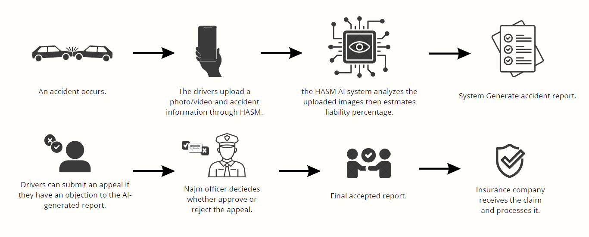

# HASM-AI-Powered-Traffic-Accident-Liability-Determination-System-

## Overview
HASM is an intelligent system designed to analyze traffic accidents and determine liability among involved parties. The system leverages computer vision and machine learning techniques to process accident images and videos, classify accident types, and generate structured reports.

## Key Features
- Automatic detection of vehicles using AI models  
- Classification of accident types (rear-end, side collision, intersection, etc.)  
- Liability estimation based on traffic rules  
- Generation of detailed accident reports  

## System Architecture
The system consists of the following main components:

- **Detection Module:** Identifies vehicles and key elements in the accident scene  
- **Classification Module:** Determines the type of accident  
- **Liability Module:** Applies rule-based logic to estimate responsibility percentages  
- **Reporting Module:** Generates structured accident reports  

## Technologies Used
- Python  
- YOLO (Object Detection)  
- Machine Learning

## System Diagram
The following diagram illustrates the system workflow and architecture:

## Note
This project is currently under development. The current version focuses on system design and initial implementation of core modules.

## Conclusion
HASM aims to provide an objective and automated solution for traffic accident analysis. By reducing human bias and improving accuracy, the system has the potential to support smarter and more reliable decision-making.
